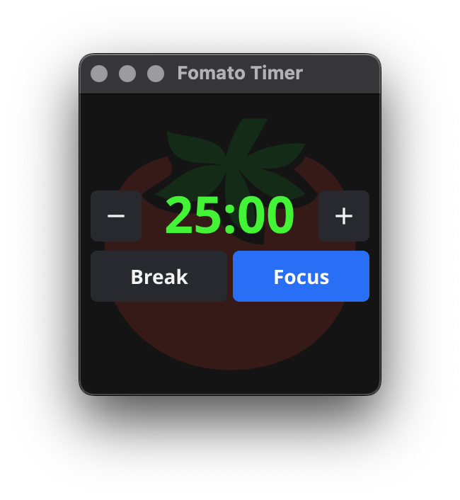

# Fomato

A simple Pomadoro timer written with Fyne.

## Features

* Preferred focus time settable in 5 minute steps
* Notifications when the timer is done
* Colour highlight when time is running out
* Take a break for 5 minutes

## Screenshot

